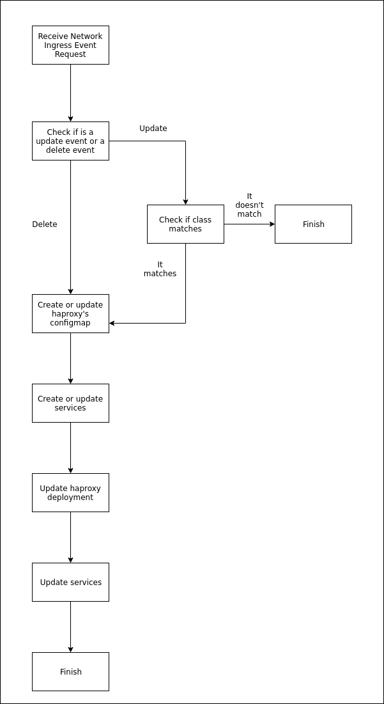

# Network Ingress Design

All the logic is in the `Reconcile` function. This function is called every time
Kubernetes detects any kind of event related to he
`networkingress.little-angry-clouds.k8s.io/v1` api. This means that this
function is awlays called when creating, updating or deleting a
`NetworkIngress`.

As any controller, what it does is always idempotent. This means that with any
event of any kind it will ensure that the state of all the things it manages, is
what it should be. For example, if you create a `NetworkIngress`, which creates
a `Service` you manually modify this service and then you create another
`NetworkIngress`, the manually modified `Service` will be restored to it's
planned state.

Before beginning the explanation, let's see the workflow the controller follows.

When receiving an event, the first it does is classify it in two kinds,
"deletion" and "update" (remember that "creation" and "update" is the same).
This is done for logging purposes but also for checking if it's necessary to
execute the whole reconciliating process.

If it's a "delete" event, the whole reconciliating process will be executed. But
if it's not, it will do an extra step before reconciliating. To be able to have
multiple `NetworkIngress` controllers, the controller implements the parameter
`network-ingress-class`. So, to avoid doing extra work, it will check if the
controller class matches. If it does, then it will reconcile, buf it it does
not, it finishes the reconciliating process, avoiding to waste resources.

Why isn't this check done when there's a "delete" event? Because the
reconciliating event is done **after** deleting the resource. This means that's
not possible to know the class of the `NetworkIngress` once it's deleted. So,
since the process is idempotent, it's called and it's a "wasted" process if the
class is not matched, since only the class matched resources will be updated.

The rest of the reconciliating process it's pretty straightfull. It ensures that
the haproxy's configmap exists and it's updated with the `NetworkIngresses`
configuration. Then, the haproxy's deployment is updated. This means that the
deployment may be restarted. It depends if there's new ports exposed. And the
last part is update the services. This process will update the ones that need to
exist and delete the others.

And that's it, when this is done, the reconciliating process is finished.
